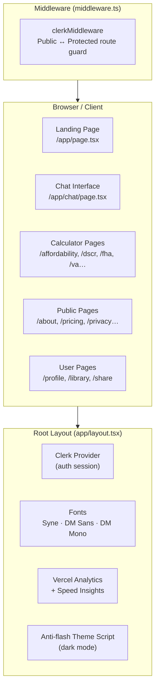
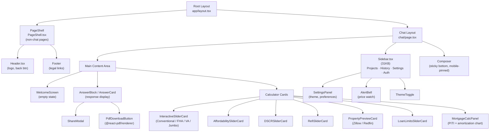
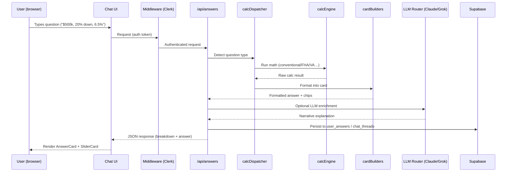
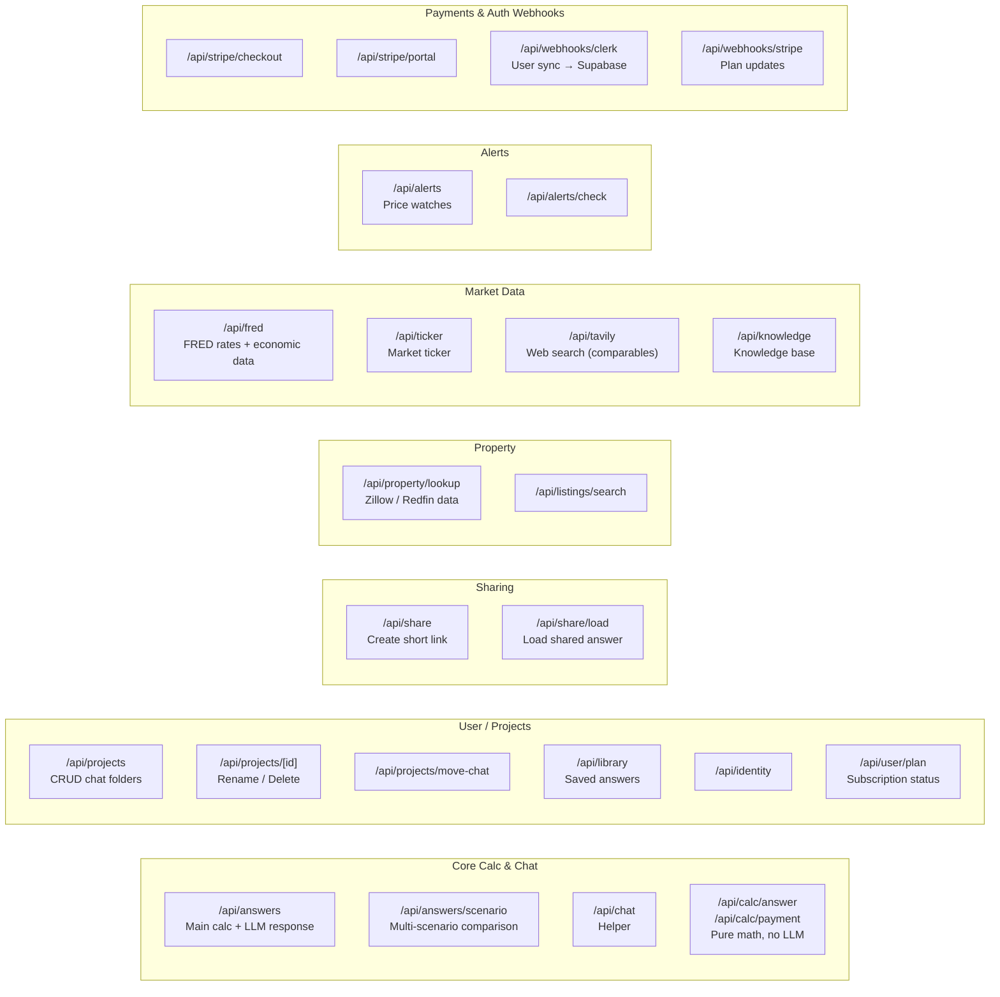
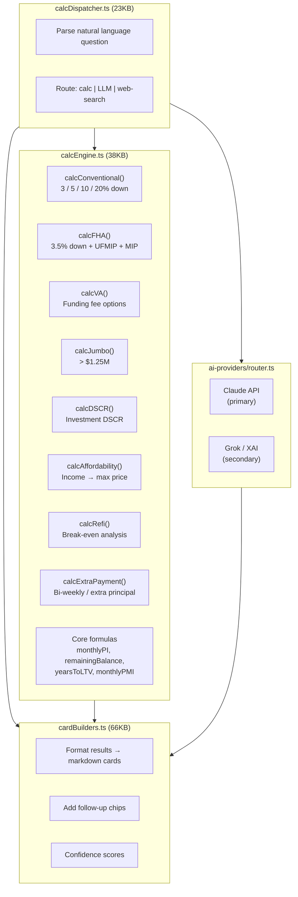
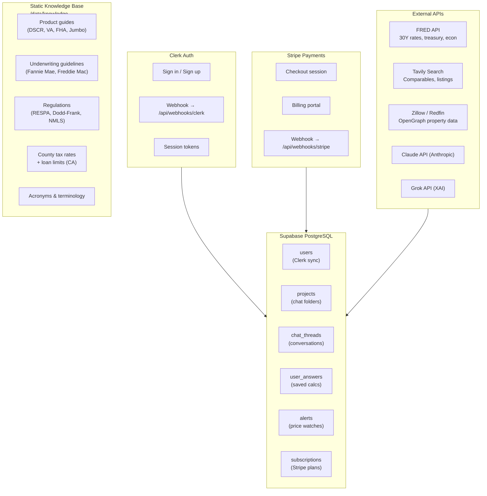
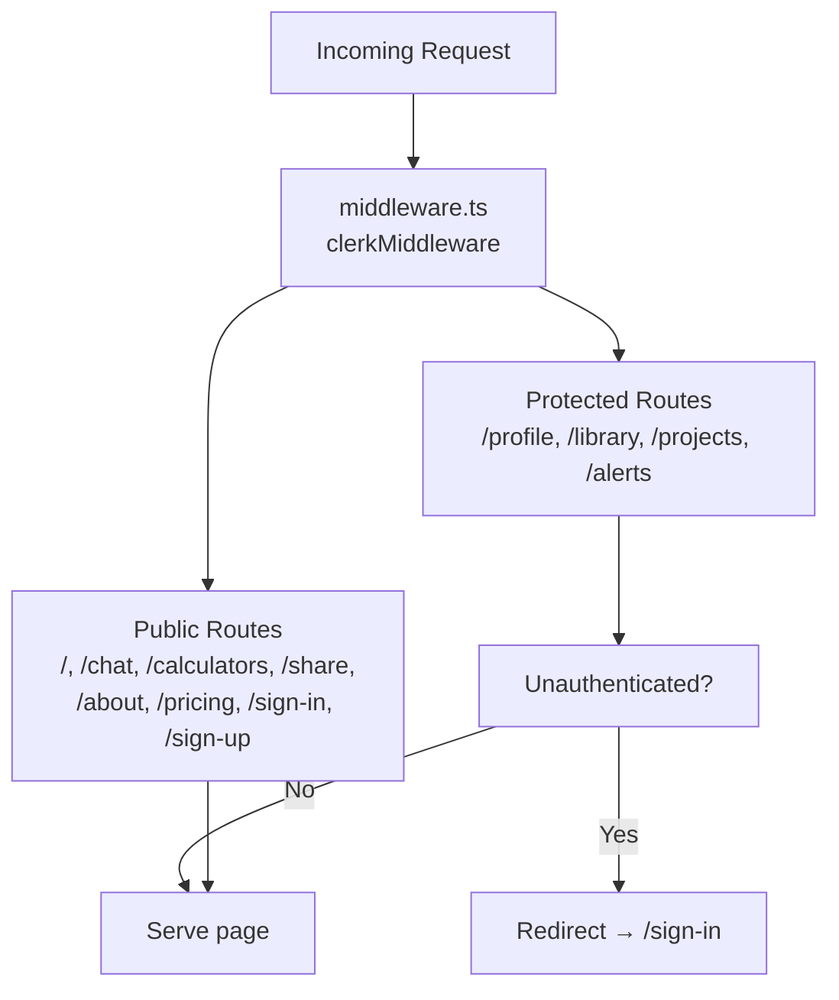
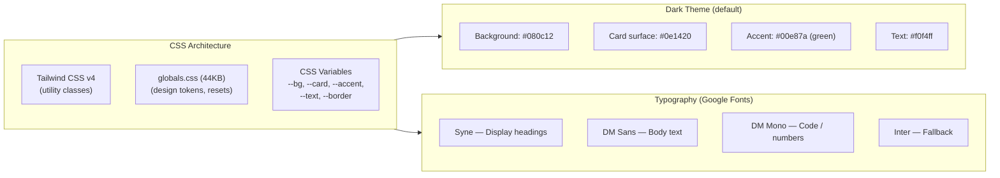
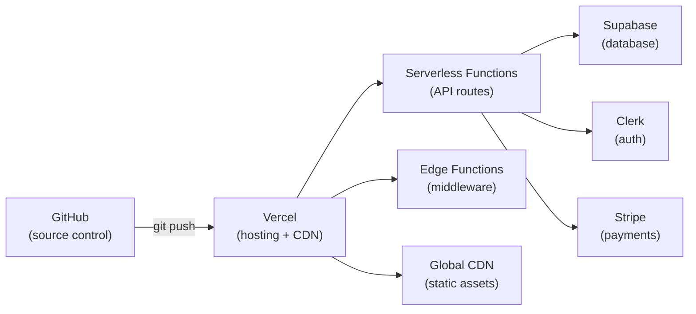

# HomeRates.ai — UI Architecture Diagram

> Generated: 2026-03-31 | Stack: Next.js 15 · React 18 · TypeScript 5 · Tailwind CSS 4 · Clerk · Supabase · Stripe

---

## High-Level Architecture

---

## Component Hierarchy

---

## Data Flow — Chat / Calculation Request

---

## API Layer (43 Endpoints)

---

## Business Logic Layer

---

## Data & Integration Layer

---

## Authentication & Route Protection

---

## Styling System

---

## Deployment

---

## Technology Summary

| Layer | Technology | Version |
|-------|-----------|---------|
| Framework | Next.js (App Router) | 15.5.7 |
| UI Library | React | 18.3.1 |
| Language | TypeScript | 5.9.3 |
| Styling | Tailwind CSS | 4.1.16 |
| Auth | Clerk | 6.37.3 |
| Database | Supabase (PostgreSQL) | 2.81.1 |
| Payments | Stripe | 21.0.1 |
| PDF Export | @react-pdf/renderer | 4.3.2 |
| Validation | Zod | 3.23.8 |
| Markdown | react-markdown | 8.0.7 |
| Query Parsing | Chevrotain | 11.0.3 |
| Web Search | Tavily | 0.7.2 |
| Primary LLM | Claude (Anthropic) | latest |
| Secondary LLM | Grok (XAI) | latest |
| Hosting | Vercel | — |
| Analytics | Vercel Analytics + Speed Insights | — |
